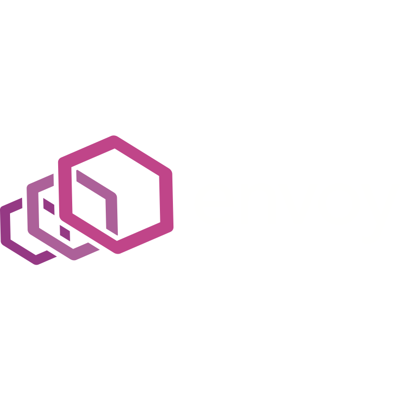

<!DOCTYPE html>
<html lang="en">
<head>
    <meta charset="UTF-8">
    <meta name="viewport" content="width=device-width, initial-scale=1.0">
    <title>Avinash Kumar Portfolio</title>
    
</head>
<body>
    

        <!-- Personal Details Section -->
        

            

                
<strong class="highlight">Avinash Kumar</strong>

                
Mob: +91 9955136036

                
Email: avinash2001aiuch@gmail.com

                
<strong class="highlight">Bachelor of Technology (B.Tech)</strong>

                
National Institute Of Technology Nagpur (VNIT)

            

            
        

        
        <!-- What Work I Do Section -->
        

            <h2>What Kind Of Work I Do</h2>
            <ul>
                <li><strong class="highlight">Infrastructure & Cloud:</strong> Proficient in managing Linux-based infrastructure, utilizing Docker, Kubernetes (K8s), Terraform, and Ansible for efficient deployment and scaling.</li>
                <li><strong class="highlight">Automation & CI/CD:</strong> Experienced in automating workflows with Jenkins, GitLab CI/CD, and Azure CI/CD, ensuring rapid and reliable software delivery.</li>
                <li><strong class="highlight">Networking & Security:</strong> Skilled in configuring Nginx, Traefik, HAProxy for robust networking, and implementing security measures with Vault and IPFire.</li>
                <li><strong class="highlight">Monitoring & Logging:</strong> Proficient in setting up monitoring solutions with ELK stack (Elasticsearch, Logstash, Kibana), Grafana stack, and Prometheus for proactive system management.</li>
                <li><strong class="highlight">Development & Scripting:</strong> Strong in C, C++, Python programming languages, and Bash scripting for automating tasks and optimizing system performance.</li>
                <li><strong class="highlight">Cloud Platforms:</strong> Experienced in AWS and Azure cloud platforms for scalable and cost-effective infrastructure solutions.</li>
                <li><strong class="highlight">Version Control & Collaboration:</strong> Utilizing Git for version control, enabling efficient collaboration and code management.</li>
                <li><strong class="highlight">Additional Skills:</strong> OpenStack, Pgbouncer, Envoy Proxy, Keepalived, Docker Compose, and managing private PyPI servers, HFS, FTP, and SMTP servers.</li>
            </ul>
        

        
        <!-- Languages and Tools Section -->
        

            <h2>Languages and Tools</h2>
            

                
                
                
                
                
                
                
                
                
                
                
                
                
                
                
                
                
                
                
                
                
                
            

        

    

</body>
</html>
